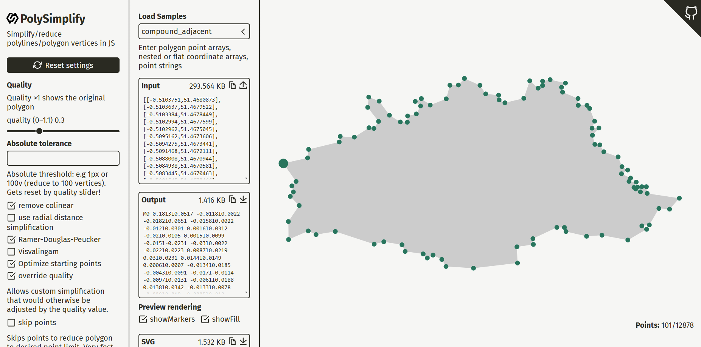

[](https://www.npmjs.com/package/poly-simplify)
[](https://bundlephobia.com/result?p=poly-simplify)
[](https://bundlephobia.com/result?p=poly-simplify)
[](https://www.npmjs.com/package/poly-simplify)
[](https://cdn.jsdelivr.net/npm/poly-simplify@latest/+esm)

<p align="center" style="text-align:center">

<h1 align="center">poly-simplify</h1>
</p> 

Dependancy free JS library to simplify polyline or polygon vertices. 

This library is *obviously* heavily inspired by Volodymyr Agafonkin's brilliant [»simplify.js«](https://github.com/mourner/simplify-js) library which has become kind of a standard.  
While most polygon simplification libraries are focused on geodata/map applications, »poly-simplify« aims at a more versatile concept e.g by providing a variety of inputs and including multiple methods for SVG graphic applications.

* [Features](#features)
* [Simplification methods](#simplification-methods)
* [1. Usage](#1-usage)
  + [1.1. IIFE](#11-iife)
  + [1.2. ESM](#12-esm)
  + [1.3 Node.js](#13-nodejs)
* [2. Options](#2-options)
* [3. Quality control](#3-quality-control)
  + [3.1 Relative Quality thresholds](#31-relative-quality-thresholds)
  + [3.2 Absolute thresholds](#32-absolute-thresholds)
* [4. Demos: Simplifier Webapp](#4-demos-simplifier-webapp)
* [Changelog, Updates and rollback](#changelog-updates-and-rollback)
  + [Rollback](#rollback)
  + [Changelog](#changelog)
* [Bug reporting](#bug-reporting)
* [Credits and further reading](#credits-and-further-reading)


## Features
* **input normalisation:** you can pass pretty much any reasonable polygon notation such as: 
  * **point-object arrays** – so `[{x:0, y:10}, {x:1, y:20}]`  
  * **stringified point data** (as provided by SVG `<polygon>` `point` attributes – `0 10 1 20`  
  * **nested arrays** like `[[0 10], [1 20]]`  
  * **JSON** stringified presentations of point arrays like `[{"x":0,"y":10},{"x":1,"y":20}]`  
  * **SVG** pathdata: `M0 0 100 200z`

* **Relative or absolute quality threshold:** simplification is controlled via a *relative* quality parameter similar to raster image compression logics – super tiny geoData polygons won't get distorted

* **SVG**: node property data (e.g SVG polygons) – constructors like SVGPoint are normalized to get a "decoupled" point array  

* **Supports compound shapes/paths** intersecting polygons interpreted as cut-out shapes

* **Dynamic decimal rounding** by default decimals are adjusted to match tiny polygon's dimensions 

* **scaling and alignment:** tiny polygons can be scaled to a reasonable size for demonstration purposes. You can also realign coordinates to zero origin


## Simplification methods
* "RC" - remove colinear: removes only colinear or zero-length segments. This method can be concidered "lossless" and is ideal for polygons with a lot of excessive point added by a graphic editor (e.g due too shape merging)
* "RD" - simplify by radial distance: removes short segments. Ideal for more aggressive simplifications
* "RDP" – Ramer-Douglas-Peucker algorithm
* "VW" – Visvalingam-Whyatt algorithm
* max vertices simplification: simply omits vertices to get the desired point count – very fast but sloppy


## 1. Usage

### 1.1. IIFE
```
<script src="https://cdn.jsdelivr.net/npm/poly-simplify@latest/dist/poly-simplify.min.js"></script>

<script>
  let pts = [{x:0, y:10}, {x:1, y:20}, {x:2, y:30}];
  let polyPtsSimplified = polySimplify(pts);
</script>
```

### 1.2. ESM
```
<script type="module">
  import {polySimplify} from 'https://cdn.jsdelivr.net/npm/poly-simplify@latest/+esm';

  let pts = [{x:0, y:10}, {x:1, y:20}, {x:2, y:30}];
  let polyPtsSimplified = polySimplify(pts)
</script>
```

### 1.3 Node.js

Install
```
npm install poly-simplify
```

Usage 
``` 
import polySimplify from 'poly-simplify';
const simplified = polySimplify('M0 0 h10 h10 v10 v10');
console.log(simplified);
```

## 2. Options

| param | default | type | effect |
| -- | -- | -- | -- |
| quality | `0.5` | number/string | simplification tolerance: accepts numeric value from 0-1 for relative quality, absolute pixel thresholds adding px unit to string `1px` or maximum vertices specified via `v` unit like so `150v` |
| RDP | `true` | Boolean | Applies Ramer-Douglas-Peucker simplification |  
| VW | `true` |  Boolean | Visvalingam-Whyatt simplification |  
| RD | `true` | Boolean | Radial Distance simplification |  
| output | `points` | string | output result: 1. "points"= point object array  2. "path"= SVG path data string 3. "pathdata" = pathdata array 4. "json"= JSON string 5. "pointString" = flat point string (as used for polygon points attribute) |
| skipPoints | `false`  | Boolean | simplify by reducing number of vertices to a max limit | 
| maxPoints | `0` | Number | Max points limit for `useMax` option |
| scale | `1` | Number | scale polygon |  
| scaleToWidth, scaleToHeight | `0` | Number | fit polygon into specified max dimensions |  
| alignToZero | `false` | Boolean | align weird starting coordinates to x/y=0 |  
| translateX, translateY | `0` | Number | set manual x/y offsets to realign polygon |  
| decimals | `-1` | Number | round coordinates to decimals. `-1` won't apply rounding. Too small floating point accuracy is auto-adjusted to avoid distortions |
| toRelative | `false`  | Boolean | **SVG** converts commands to relative – more compact |  
| toShorthands | `false`  | Boolean | **SVG** applies shorthand commands where possible `h`, `v` – more compact |  
| minifyString | `false`  | Boolean | **SVG** applies string based minification e.g omitting leading zeroes or concatenating subsequent floats `.123.456` – more compact |  
| meta | `false`  | Boolean | return additional data like: vertices counts (original and simplified) – this option is mostly for debugging e.g for integrety checks  |


## 3. Quality control
### 3.1 Relative Quality thresholds  
By default poly-simplify expects a value between 0–1.   
This concept tries to achieve a relative quality similar to raster image compression settings such as Jpg quality levels:  
* `1` - we only apply "lossless" simplification by removing only colinear points. More aggressive simplification algorithms like Radial-distance, Ramer-Douglas-Peucker or Visvalingam-Whyatt are disabled
* `0.5 – 1` – tries to find a ballance between visual fidelity and point reduction
* `<0.5` – adjusts thresholds for more aggressive simplification
This approach will auto-detect **reasonable thresholds** by approximating the total dimensions of a polygon. So geoData polys that may be smaller than 1px/unit can be simplified without the need to know a suitable tolerance7threshold that might be `0.00001px`

### 3.2 Absolute thresholds  
You can also enter an absolute threshold via string input:  
`1px` – sets the simplification threshold to absolute 1 units – bear in mind this may lead to heavy distortions if your polygon is way smaller than the threshold value
`150v` – the `v`(vertices) unit will add a maximum point limit to the simplification. In this example: reduce to a maximum of 150 points/vertices.


##  4. Demos: Simplifier Webapp
You can easily test poly-simplify using the [**webapp**](https://herrstrietzel.github.io/poly-simplify/)  



You can test all settings and generate sample SVG files for demo purposes:
* output object (point array, nested array, SVG or JSON)
* SVG snippet
* JS code snippet

## Changelog, Updates and rollback
### Rollback
If you encounter any issues with the recent versions you can rollback to a previous version.  
See all versions on 
* [npm](https://www.npmjs.com/package/poly-simplify)  
* [jsdelivr](https://www.jsdelivr.com/package/npm/poly-simplify)

### Changelog
* 0.1.4 fixed problems with linear polylines


## Bug reporting
If you found a bug - feel free to file an [issue](https://github.com/herrstrietzel/poly-simplify/issues).   
For debugging you may also test your example in the [webapp](https://herrstrietzel.github.io/poly-simplify). 
You can also post in the [discussions](https://github.com/herrstrietzel/poly-simplify/discussions) if you have ideas for missing features.

## Credits and further reading
* Volodymyr Agafonkin for [»simplify.js«](https://github.com/mourner/simplify-js)
* Mike Bostock (d3.js) on [Line Simplification](https://bost.ocks.org/mike/simplify/)


